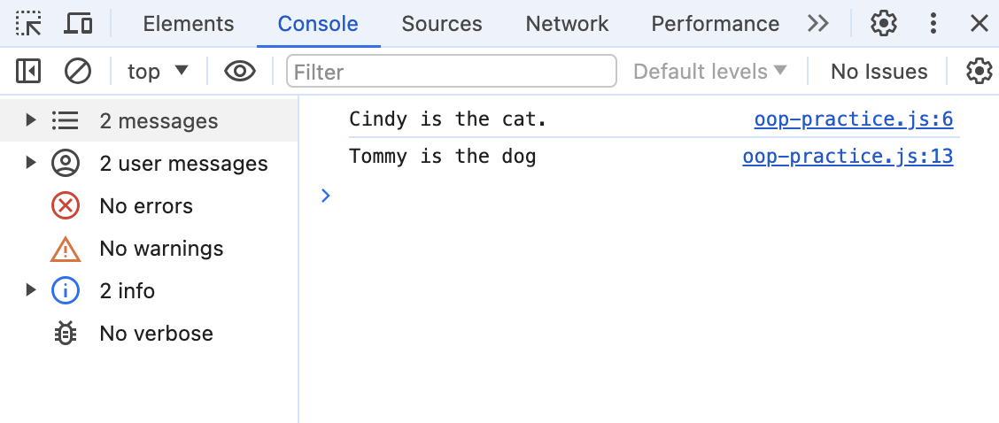

## Named and Anonymous Class and Prototype Method Example
This repository contains JavaScript code demonstrating the implementation of an Named and Anonymous Class and a prototype method for finding occurrences of a word in a string.

### Usage
1. Clone the repository or download the JavaScript file.
2. Open the file in a JavaScript environment such as a browser console or a Node.js environment.

### Code Explanation
The code consists of several steps, each building upon the previous one:
**Step 1:** Introduction to named and anonymous class declarations. 
**Step 2:** Instantiation of instances of Cat and Dog classes. 
**Step 3:** Creation of a basic Animal class with a constructor. 
**Step 4:** Modification of the Animal class constructor to accept a custom message. 
**Step 5:** Addition of properties to the Animal class constructor. 
**Step 6:** Iteration through the properties of an Animal instance. 
**Step 7:** Enhancement of the Animal class with a speak method based on the animal type. 
**Step 8:** Instantiation of Cat and Dog instances with the speak method invocation. 
**Step 9:** Extension of the String prototype with a findWords method to count occurrences of a word in a string. 

### Running the Code
To run the code:

* Uncomment the desired code section within the JavaScript file.
* Execute the file in a JavaScript environment.

### Example Output
Depending on the selected code section, the output may vary. Here are some possible outputs:

